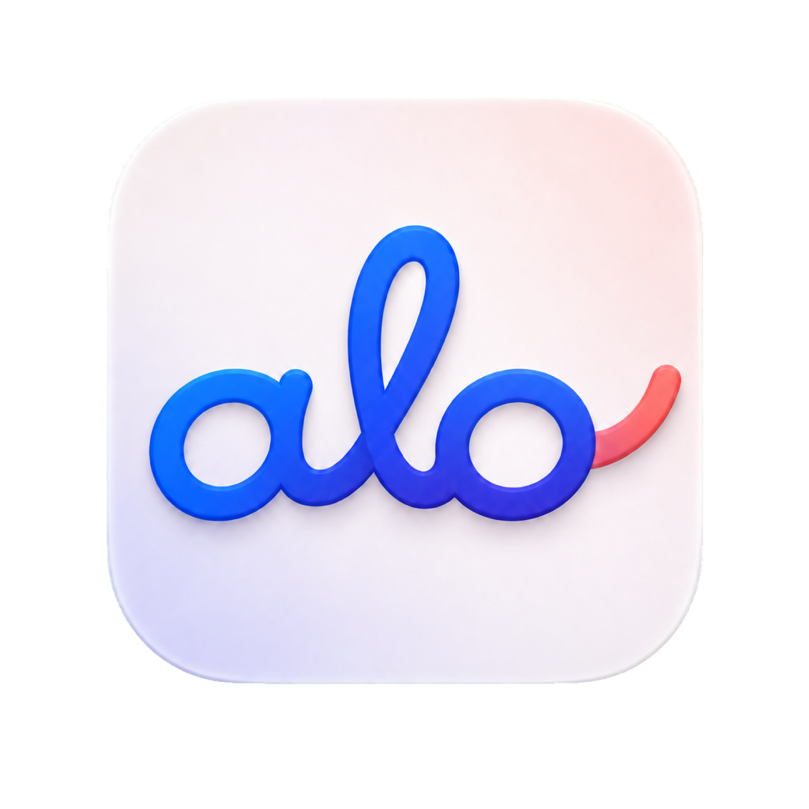

# ALO

Listen together.

Share what’s playing on your Mac. Hear it together, in sync.

[Download for Apple Silicon](https://github.com/theShyamsindhia/ALO/releases/latest/download/ALO-macos-arm64.dmg) · [Release notes](https://github.com/theShyamsindhia/ALO/releases/latest) · [Build from source](#build-it)

Free and open source. Made for macOS. Audio, screens, voice, and chat between locally connected Macs.

## One room, together

ALO creates a persistent local group with synchronized 48 kHz stereo audio, optional
full-screen video sharing, current album artwork, a per-Mac mixer, participant presence, group
chat, and a shared media queue. There is no permanent host: any member can begin
broadcasting, and the room remains available when its creator leaves. Exactly one Mac
broadcasts media at a time while every connected Mac replicates the room's control,
chat, and queue state.

Rooms are public on the local network by default. A creator can instead make a private
room protected by an invite key. Saved room details appear again when the app opens;
private invite keys are stored in the macOS Keychain, while recent chat and durable
queue state are stored locally.

## Requirements

- macOS 14.2 or newer
- Built-in, wired, USB, or Bluetooth audio output
- Macs that can discover and reach each other locally. The same Wi-Fi/LAN is the
  recommended setup; client isolation or firewall rules can block connections.

ALO enables Apple's peer-to-peer networking for discovery and authenticated
connections where the operating system makes those paths available. Room traffic
does not require an internet connection or a cloud relay. Wi-Fi hardware must
remain available for nearby wireless paths; this is not Bluetooth audio transport
between room members. Router-free reachability depends on devices, radio
conditions and OS policy—it is not guaranteed by turning on airplane mode.

The 0.14 integration includes an iPhone/iPad receiver and voice client for iOS 17+
in [the iOS project](iOS/README.md). Device installation requires its own signing
setup; the Mac download does not install an iOS app. Legacy rooms remain an
explicit compatibility mode and cannot silently downgrade a secure room.

## Run the Mac app

Download the latest disk image, drag **ALO** into **Applications**, and open it.
If you built from source, open `dist/ALO.app`. The first screen lists nearby rooms
and rooms previously saved on this Mac:

- Select a nearby or saved room to rejoin it.
- Choose **Create Room** for a new public room, or enable **Private** to generate an
  invite-key-protected room.
- In an open room, choose **Broadcast** to share this Mac's system audio. Any member
  may take over broadcasting; leaving does not delete the room.

The first time a Mac broadcasts, macOS asks for **System Audio Recording Only** permission.
ALO uses one Core Audio tap both to capture the room stream and replace that Mac's immediate
source playback with the synchronized return. Screen sharing separately uses **Screen & System
Audio Recording**. After either first grant, restart ALO if macOS requests it. No speaker output
or audio driver is installed.

After the room connects, the setup window disappears and the room moves into the
menu bar. Click the cat to reveal the compact controls; the same surface grows
downward only when chat, queue, people, or video is requested. A red indicator on the
menu-bar icon marks unread chat without leaving another window on screen. The optional
floating bar can be restored from the window control and remains above your other apps
and across macOS Spaces. In either presentation,
the queue owns its media-link field, chat owns its message composer, and people owns the
per-Mac mixer. Incoming video can expand in the surface or open in its own resizable,
minimizable window. That window supports native macOS fullscreen and can stay pinned
above normal windows across Spaces without interrupting audio. Unread chat is also shown
on the message control.
When the source player publishes track information, the active broadcaster sends
the title, artist, and album artwork to every Mac. Video sharing remains off by
default. Members control their own output, while shared transport actions are applied
by the active broadcaster and replicated to the group.
The menu-bar cat provides the complete room experience without requiring the
floating bar. Its window button toggles the floating presentation at any time. On
listening Macs, keyboard, Touch Bar, headphone, and Control Center
play/pause/previous/next commands are forwarded to the active broadcaster; volume
buttons continue to control the local Mac.
ALO checks its GitHub Releases page shortly after launch and every six hours. Choose
**ALO → Check for Updates…** at any time for a manual check. Room members also advertise
their app version, so seeing a newer member triggers the same official-release check.
Updates are never copied from another room member: ALO downloads the Apple Silicon ZIP
from GitHub, verifies GitHub's SHA-256 digest, the `in.werai.audio` bundle identity,
Developer ID team `R9QFK9NM3Y`, and Gatekeeper acceptance, then replaces and relaunches
the app. macOS asks for administrator approval only when the app's folder requires it.
The interface follows macOS accessibility preferences for reduced motion, reduced
transparency, increased contrast, and the user-selected control accent.

## Build it

The Swift package and app module are `ALO`, shared Swift code is `ALOCore`, and
the executable is `alo`. After packaging, `./alo` runs `dist/alo`; the old
`./werai` launcher forwards to it for compatibility.

### Rebrand compatibility

ALO intentionally retains the `in.werai.audio` production bundle ID, separate
`in.werai.audio.dev` development ID, existing `WERAI` / `WERAI-Dev` data folders,
Keychain services, Bonjour service types, and legacy driver/shared-memory ABI.
Changing those names cosmetically would lose existing permissions, saved rooms,
or interoperability with installed versions. `ALO_*` signing settings are preferred;
existing `WERAI_*` settings remain supported as fallbacks.

The canonical repository is [theShyamsindhia/ALO](https://github.com/theShyamsindhia/ALO).
GitHub redirects the former repository URL, including update requests from older
installed apps. Do not reuse the old repository name: that would break those redirects.
Existing clones can switch to the canonical URL without moving their working files:

```sh
git remote set-url origin https://github.com/theShyamsindhia/ALO.git
```

The local checkout folder may retain its old name; it does not affect the app's identity.
See [brand assets](docs/brand/README.md) for the ALO mark and GitHub share image.

Build once on each Mac with Apple's free Command Line Tools:

```sh
xcode-select --install
git clone https://github.com/theShyamsindhia/ALO.git
cd ALO
swift build -c release
```

The terminal interface remains available. On the source Mac:

```sh
./alo host "My Room"
```

On every other Mac:

```sh
./alo join "My Room"
```

The room name is optional. Without one, a receiver joins the first room it finds.

Broadcasting audio uses ScreenCaptureKit and needs **Screen & System Audio Recording**.
ALO requests access when a member first chooses **Broadcast**, before claiming the room's
media timeline. When the active broadcaster also enables video, ALO opens the native macOS
sharing picker. Choose one display or one window; cancelling the picker leaves video off.
The selected content is then streamed to the room.
Every Mac may also ask for **Local Network** access.
Grant recording access in System Settings → Privacy & Security, then use **Restart ALO**
before the first broadcast.

If the Screen Recording switch is already on but macOS still refuses access, quit old
copies of ALO, turn the switch off and on once, and restart the current app. Do not
keep numbered copies such as `ALO 2.app` or `ALO 3.app` in Applications; macOS can
retain stale privacy records for those development builds.

Video sharing intentionally requires the user's Screen Recording consent. ALO excludes
its own windows from the native picker.

Every open room also has a compact walkie-talkie bar. Hold a colored device icon to talk
only to that Mac, or hold the people icon to talk to everyone. **Open line** keeps the selected
voice line open; enable it on both Macs for a two-way line. Choose the active hardware microphone from
the labeled microphone menu. Voice targets stay in ALO's unified popover or optional floating
controls. Incoming speakers highlight clearly. The incoming-audio menu can mute
Music & Video, Voice Lines, or everything. Microphone access is requested only when voice
transmission starts; if it was previously denied, ALO links directly to Microphone settings.

Use **Customize this Mac** on the room picker to change
its generated device name, emoji, color, and optional profile photo. Identity changes persist on that Mac
and propagate to the current room immediately. The walkie bar can be dismissed with its
close button; the same controls remain available from ALO's menu-bar popover.

ALO leaves the selected physical output unchanged. Its private Core Audio tap is the single
authoritative broadcast source: it feeds the room and replaces the broadcaster's immediate
render with the same synchronized return. No additional device appears in the Sound picker.

## Share a ready binary

```sh
./Scripts/package.sh
```

This produces `dist/ALO-macos-universal.zip` for Apple Silicon and Intel Macs. AirDrop
or copy it to the other Macs, unzip it, and open ALO. If Gatekeeper quarantines an
AirDropped ad-hoc-signed development build, build from source on that Mac.

The packaged app uses a stable local designated requirement (`in.werai.audio`) so a
new ALO build does not silently become a different app in macOS privacy settings.

## Mesh room architecture

ALO separates room coordination from the high-rate media stream:

- Every member advertises and discovers the room over Bonjour and maintains direct
  authenticated TLS control links in secure-v2 rooms. A deterministic peer-ID rule
  prevents duplicate links. Nearby paths use the same protocol as LAN paths.
- Durable chat and queue state synchronize through **Automerge**, with a separate
  sync session for each reliable peer connection. A replacement connection starts
  with fresh sync knowledge; older peers use the bounded legacy event-sync path.
- Presence, playback commands, broadcaster ownership and voice consent use the
  realtime control plane. Automerge is not the audio clock or media transport.
- Audio and directed voice use independent, authenticated UDP subscriptions.
  Voice carries 10 ms of 48 kHz mono PCM per packet to a fixed, explicitly selected
  recipient set. Receiving voice never opens the recipient's microphone.
- Video has a separate authenticated reliable connection. Shared annotations are
  presenter-authoritative vector events, not pixels burned into video or
  Automerge documents. Their bounded lifecycle is independent of audio.
- The current broadcaster sends timestamped audio and video directly to all listeners.
  This keeps one shared media timeline without making the room creator a permanent
  server. If the broadcaster leaves, the room stays connected and silent until any
  remaining member chooses **Broadcast**.
- Concurrent attempts to take over broadcasting are resolved deterministically, so all
  replicas settle on the same source. A later take-over supersedes the prior claim.
- Queue removals are replicated as tombstones, so an old add event cannot resurrect a
  removed item after a temporarily disconnected peer returns.
- Each Mac retains durable queue state and up to 500 chat events, including edits
  and reactions. This count-based cache is not a permanent archive. Transient broadcaster ownership is deliberately not restored after relaunch.

Secure-v2 public rooms are discoverable and joinable on reachable local links;
private rooms additionally require the room's 32-byte invite secret. Both use
installation identities, pinned peer keys, TLS 1.3 admission and session-bound
AES-GCM datagrams with replay protection. A public room is encrypted in transit,
but is not access-restricted. First-contact trust is not independent verification
of a person's identity. Legacy rooms retain their older, weaker channel protection.
See the [channel-by-channel audit](docs/room-privacy.md).

Per-person **Voice on this Mac** levels persist independently of media volume. Room
settings include optional music ducking during incoming speech and local microphone
routing details. Status dots in People show per-device state; hover for details.


## How synchronization works

- Eight rapid clock samples are taken when a Mac joins, followed by a continuous sample
  every second. A low-latency clock model estimates both offset and drift while rejecting
  Wi-Fi spikes.
- The room establishes one shared playout target before audio begins. A joining
  device adopts that timing; a slow late joiner's network estimate cannot retime
  healthy listeners. A larger hardware-output floor uses one announced future
  capture boundary, with bounded old/new playback ownership rather than a room restart.
- Output-device latency and render headroom are measured per Mac. Remaining error is
  corrected 20 times per second with a smoothed varispeed adjustment capped at 1%.
- Each receiver watches the audio render clock while packets are still arriving. If a
  CPU spike stops that clock for 250 ms, or pushes playback more than 100 ms ahead or
  behind the room timeline, it flushes stale scheduled audio and re-anchors itself.
- Play and pause in the room bar are shared controls. A member's request is sent to the
  current broadcaster, applied to its active system media player, and rebroadcast to the room.
- Listening Macs publish the room as their active macOS Now Playing session, allowing
  system and accessory transport buttons to use the same broadcaster-authoritative command path.
- Video follows the audio timeline, with bounded send/decode/presentation queues
  and fresh-keyframe recovery. Sync diagnostics report audio render drift and screen
  handoff lateness; stale or missing measurements are not reported as verified sync.
  These measurements do not replace physical speaker/display lip-sync testing.
- Audio uses about 1.54 Mb/s per receiving Mac. Video targets about 4 Mb/s at up to
  1280×720 and 30 fps using Apple’s hardware H.264 encoder.
- Packet loss becomes a short silence rather than delaying every receiver.
- Room traffic stays on local network paths without a cloud media relay. Encryption
  varies by channel; see [room privacy](docs/room-privacy.md).
- Spotify artwork is resolved once per track through Spotify’s public HTTPS artwork
  endpoint; no Spotify account token is used. Other players use macOS Now Playing data
  when the system makes it available.
- Bluetooth format and latency transitions are detected and the output graph is rebuilt
  without discarding the voice jitter cushion. Bluetooth adds device latency, so ALO is
  not intended for live musical performance.

## Verify

Run the complete test suite:

```sh
swift test
```

Run only the fast, deterministic timing model:

```sh
swift test --filter RoomScaleLatencyReproductionTests
```

Run the realistic single-Mac room test:

```sh
swift test --filter LoopbackRoomScaleTests
```

Run the focused single-Mac mesh tests:

```sh
swift test --filter MeshRoomTests
```

Run the combined live-socket scenario and repeatable partition/restart simulations:

```sh
bash Scripts/test_room_scenarios.sh 3
```

This keeps per-run logs and checks mixed media/voice/chat traffic, repeated late
joins, disk restoration, delayed links, offline edits, and convergence after
network partitions. See [scenario coverage and hardware-test limits](docs/room-scenario-testing.md).

For automated two-Mac QA without UI automation, save or join the room once in
the app on each Mac, then run the signed app binary on either Mac:

```sh
/Applications/ALO.app/Contents/MacOS/alo room "Room Name"
# Start as broadcaster when no one is sharing:
/Applications/ALO.app/Contents/MacOS/alo room "Room Name" --broadcast
# Join first, then claim the newer broadcaster epoch for a handoff test:
/Applications/ALO.app/Contents/MacOS/alo room "Room Name" --take-over
```

This opens the same mesh control plane, receiver, clock synchronization, and
audio renderer as the GUI. Lines prefixed with `ALO_QA` expose connection,
playback, peer-version, and participant state for a test harness.
Grant Screen & System Audio Recording from the GUI on that same Mac before using
`--broadcast` or `--take-over`; macOS cannot complete the first consent prompt from
an SSH-only session.

This suite opens real loopback TCP listeners for three independent peers and verifies
that the control mesh remains usable after the creator disconnects. It also checks
public admission, successful private admission, rejection with a wrong private key,
replica/version-vector convergence, concurrent broadcaster conflict resolution, queue
tombstones, and bounded chat/queue persistence. It does not advertise on the LAN,
capture audio, prompt for recording permission, or write test credentials to Keychain.

The loopback suite starts the real host plus headless TCP and UDP peers on one Mac. It
compares an unconstrained room, one receiver on a constrained link, eight receivers
with unbounded buffering, and eight receivers with bounded buffering. It also exercises
late-playback detection, receiver telemetry, CPU-stall recovery, shared play/pause
control, and automatic hard resynchronization. It does not need Screen Recording
permission or additional Macs.

Useful output from the loopback test includes:

- **Final packet age:** must remain below the room's active playout delay.
- **Audible lateness:** should remain at zero; a positive value means playback missed
  the shared timeline.
- **Arrival skew:** shows how far receivers diverged while receiving the same packet.
- **Packets delivered:** exposes the audio-quality cost of dropping stale packets.
- **Resync commands:** confirms that the host detected late receivers and requested
  live recovery.

### Fine-tune synchronization

Change one control at a time and compare it with the unbounded baseline in
`LoopbackRoomScaleTests`:

- `RoomTiming.defaultPlayoutDelayNanos`, `maximumPlayoutDelayNanos`, and
  `timingStepNanos` control the initial shared room buffer before its timeline locks.
- `SynchronizedPlayer.hardResyncThresholdNanos` controls when gradual varispeed
  correction gives way to a hard re-anchor.
- `PlaybackWatchdog.stallThresholdNanos` controls how long an active receiver's render
  clock may stop before it re-anchors. `activePacketWindowNanos` prevents an intentionally
  paused source from being mistaken for a stalled client.
- Every accepted play or pause command broadcasts an explicit hard-resync command. This
  makes the menu-bar, floating-bar, and hardware media controls a manual recovery path:
  pause and play once to re-anchor every receiver to the shared capture timeline.
- `HostServer`'s `boundedLatest(maxInFlight:)` default controls how many packets each
  receiver may have outstanding before stale pending audio is replaced.
- `linkBitsPerSecond`, peer count, callback count, and callback cadence in
  `LoopbackRoomScaleTests` define repeatable congestion scenarios.

After tuning, run all three focused suites at least twice, followed by `swift test`. A useful
change should keep the direct eight-peer control lossless, reduce packet age and audible
lateness in the constrained eight-peer case, and avoid excessive hard resynchronizations.

The broader tests also cover audio and video framing, room media and queue state, mixer
state, packetization timing, clock offset and drift, adaptive jitter handling, malformed
input, and fragmented messages.

## GitHub builds and releases

Publishing a GitHub Release runs **Build Apple Silicon app** on an Apple Silicon GitHub
runner. The workflow imports the repository's encrypted Developer ID certificate into an
ephemeral keychain, enables the hardened runtime, submits the app and disk image to Apple's
notarization service, staples the approval tickets, and verifies Gatekeeper acceptance.
Manual workflow dispatch remains available for signing diagnostics.

The repository must provide `DEVELOPER_ID_P12_BASE64` and
`DEVELOPER_ID_P12_PASSWORD` as Actions secrets, plus
`APP_STORE_CONNECT_API_KEY_BASE64` as an Actions secret. Configure
`ALO_CODESIGN_IDENTITY` (legacy `WERAI_CODESIGN_IDENTITY` is also accepted),
`APPLE_TEAM_ID`, `APP_STORE_CONNECT_KEY_ID`, and
`APP_STORE_CONNECT_ISSUER_ID` as Actions variables. Use an App Store Connect
team key (Developer access or higher), because individual API keys cannot submit
software to Apple's notarization service. The imported P12 must contain the
**Developer ID Application** identity and its private key.

To publish a downloadable build on the repository's **Releases** page:

1. Update `CFBundleShortVersionString` and `CFBundleVersion` in `Resources/Info.plist`.
2. Commit and push the version change to `main`.
3. Create a tag matching `CFBundleShortVersionString` exactly, with an optional leading
   `v`, and publish a GitHub Release for that tag. For example:

   ```sh
   gh release create v0.9.0 --target main --generate-notes
   ```

Publishing the release automatically attaches notarized and stapled
`ALO-macos-arm64.zip` and `ALO-macos-arm64.dmg` downloads to the release.

If an older ad-hoc-signed copy appears enabled under **Privacy & Security → Screen &
System Audio Recording** but still cannot start a room, remove the old ALO entries,
install the newly signed release in `/Applications`, launch it, and grant recording access
again. This one-time reset replaces the stale permission record created by the old build.

ALO 0.12.1 and newer do not install or use the old `ALO Room` audio device. If a prior
test build installed it, remove that one legacy copy in Terminal and restart Core Audio:

```sh
sudo /bin/rm -R /Library/Audio/Plug-Ins/HAL/ALORoom.driver
sudo /usr/bin/killall coreaudiod
```

## License

MIT. No paid service, account, server, or third-party runtime dependency.

## Optional notch presentation

Open **ALO → Notch Settings…**, or **Talk settings → Notch**, and enable the notch.
Every additional feature starts disabled. The full settings window exposes original
DynamicNotch feature options for media, downloads, timers, file tray/AirDrop, conversion,
camera, CPU/RAM, battery, Bluetooth, Wi-Fi/hotspot, VPN, Focus, volume/brightness HUDs,
calendar, screenshots/OCR, recording notifications, Mail/Messages/external drives,
and lock-screen presentation.

Enable only the features you want. Features requiring access to camera, calendars,
Contacts, Accessibility, or protected files use the corresponding macOS permission
flow. Turning off a feature stops its monitor; turning off the notch stops all feature
services while retaining your choices. Camera and CPU/RAM capture are also tied to
page visibility. The notch works outside a room for utility features; room controls
appear when you join a room. Use **Activities** and **Room controls** to switch surfaces.

Original DynamicNotch shapes, spring motion, feature views, and settings are compiled
as `ALONotchRuntime`; ALO supplies the lifecycle and window adapters. The standalone
updater, onboarding and donation animations are excluded. Resources and third-party
licenses are included in packaged builds. See [the feature inventory](docs/dynamic-notch-features.md),
[validation](docs/notch-validation.md), and [provenance/license](Vendor/README.md).
